# Pyxel Arcade

**Play it: [alexkorol.github.io/pyxel-arcade](https://alexkorol.github.io/pyxel-arcade/)**

A pocket arcade of tiny games and toys built with the
[Pyxel](https://github.com/kitao/pyxel) fantasy console. Every cartridge is a
single dependency-free Python file, run **in your browser** by the Pyxel Web
Launcher — no install, no build step. The same file runs natively with
`pip install pyxel && python demos/<name>.py`.

There's a [daily world](https://alexkorol.github.io/pyxel-arcade/#/daily)
with a shared seed, animated previews on every card, tag filtering and
search, share links that unfurl properly, and the site installs as a PWA.
New cartridges show up in [feed.json](https://alexkorol.github.io/pyxel-arcade/feed.json)
/ [feed.xml](https://alexkorol.github.io/pyxel-arcade/feed.xml).

## The cartridges

| | | | |
|---|---|---|---|
| [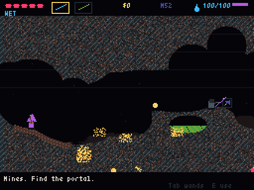](https://alexkorol.github.io/pyxel-arcade/games/noita_demake.html) | [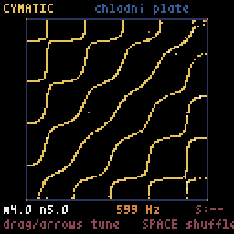](https://alexkorol.github.io/pyxel-arcade/games/cymatic.html) | [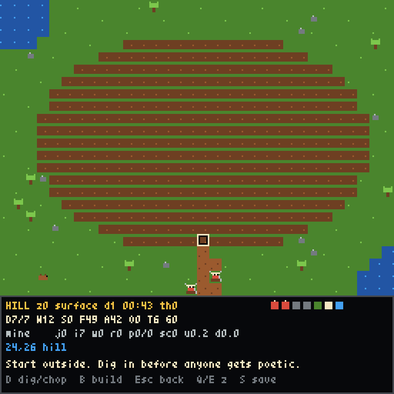](https://alexkorol.github.io/pyxel-arcade/games/hill_fort.html) | [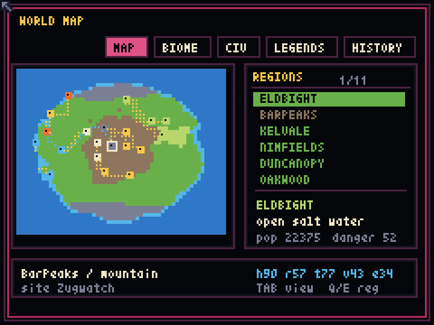](https://alexkorol.github.io/pyxel-arcade/games/stone_ledger.html) |
| [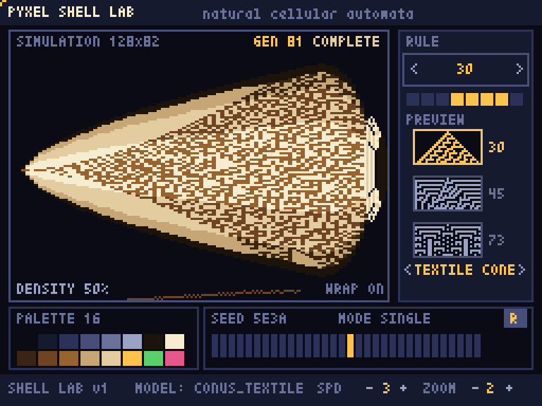](https://alexkorol.github.io/pyxel-arcade/games/shell_lab.html) | [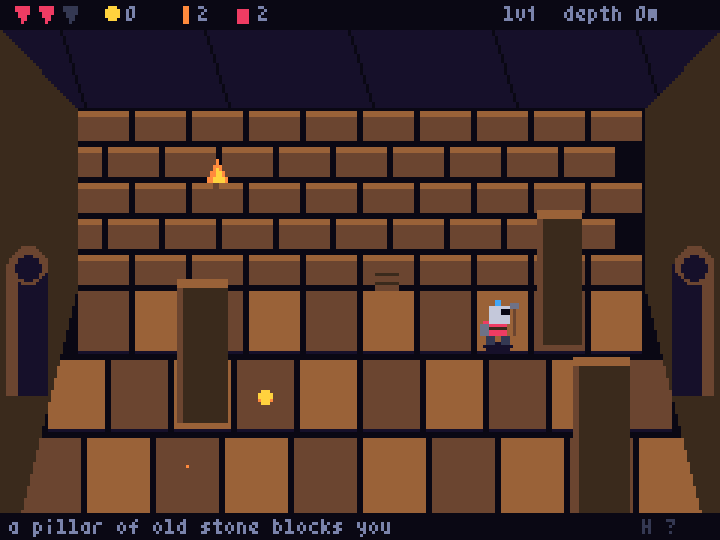](https://alexkorol.github.io/pyxel-arcade/games/undervault.html) | [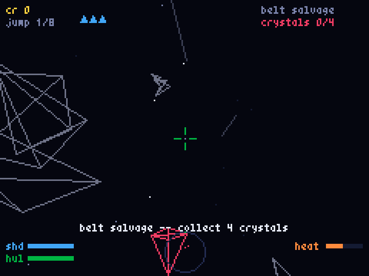](https://alexkorol.github.io/pyxel-arcade/games/starlance.html) | [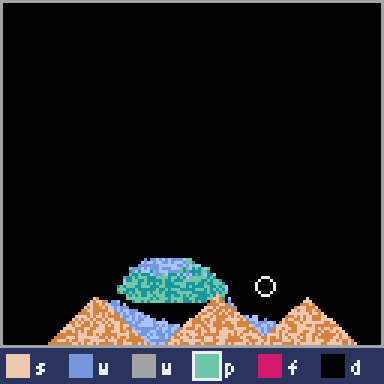](https://alexkorol.github.io/pyxel-arcade/games/powder_box.html) |
| [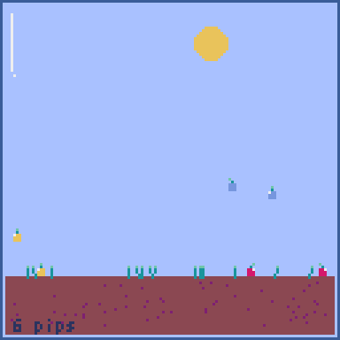](https://alexkorol.github.io/pyxel-arcade/games/terrarium.html) | [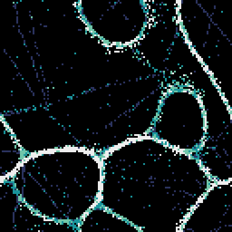](https://alexkorol.github.io/pyxel-arcade/games/physarum.html) | [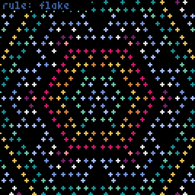](https://alexkorol.github.io/pyxel-arcade/games/hex_bloom.html) | [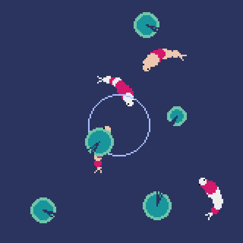](https://alexkorol.github.io/pyxel-arcade/games/koi_pond.html) |
| [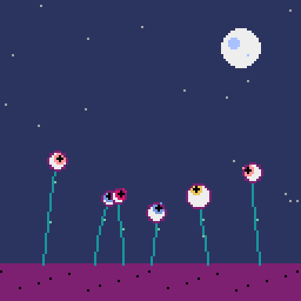](https://alexkorol.github.io/pyxel-arcade/games/oculus_garden.html) | [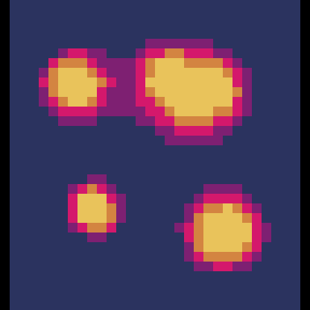](https://alexkorol.github.io/pyxel-arcade/games/lava_lamp.html) | [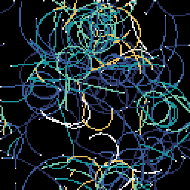](https://alexkorol.github.io/pyxel-arcade/games/color_mycelium.html) | [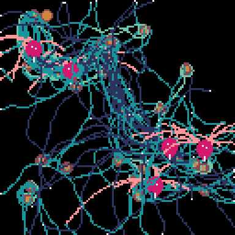](https://alexkorol.github.io/pyxel-arcade/games/mycelium_garden.html) |

## How it works

- [`demos/manifest.json`](demos/manifest.json) is the single source of truth:
  title, description, controls, tags, difficulty, touch support.
- The site is a static page on GitHub Pages; the launcher pulls each `.py`
  straight from `master`, so a merged PR is instantly playable.
- CI ([`tools/check_demos.py`](tools/check_demos.py)) rejects non-stdlib
  imports, validates the manifest, and boots every game headlessly for 120
  frames before anything lands.
- Animated card previews are recorded by
  [`tools/make_previews.py`](tools/make_previews.py), which drives each game
  headlessly and scripts its way past title screens.

## Add your own game

One single-file cartridge, one manifest entry, one PR — see
[CONTRIBUTING.md](CONTRIBUTING.md). Start from
[`demos/_template.py`](demos/_template.py).

## License

MIT.
